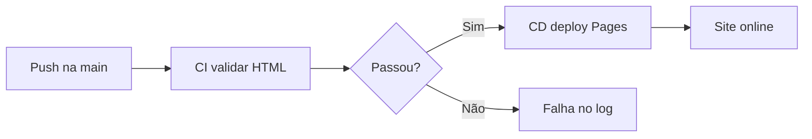

<div align="center">

# DevOps & DataOps — Pipeline CI/CD + GitHub Pages

**Atividade prática · Pipeline Automatizado CI/CD**

<br/>


<br/>


<br/>

**Site publicado:** [magnasoluto.github.io/DataOps](https://magnasoluto.github.io/DataOps/)  
**Repositório:** [github.com/MagnaSoluto/DataOps](https://github.com/MagnaSoluto/DataOps)

</div>

---

## Visão geral

Entrega individual com **uma página HTML moderna** condensando a matéria de **DevOps & DataOps**, publicada automaticamente via **GitHub Actions** no **GitHub Pages**.

| Item | Detalhe |
|------|---------|
| **Objetivo** | Criar, configurar e validar um pipeline CI/CD completo |
| **Stack** | Git · GitHub · GitHub Actions · GitHub Pages · HTML/CSS |
| **Branch** | `main` |
| **Deploy** | Automático a cada push em `site/**` |

---

## Pipeline (fluxo automatizado)



```
  ┌─────────────┐     ┌──────────────────┐     ┌─────────────────────┐     ┌──────────────────┐
  │ git push    │ ──► │  CI · ci.yml     │ ──► │  CD · cd.yml        │ ──► │  GitHub Pages    │
  │  site/**    │     │  validar HTML    │     │  upload site/       │     │  /DataOps/       │
  └─────────────┘     └──────────────────┘     └─────────────────────┘     └──────────────────┘
```

---

## Estrutura do repositório

```text
DataOps/
├── site/
│   └── index.html              ← Página única da entrega
└── .github/
    └── workflows/
        ├── ci.yml              ← Integração Contínua
        └── cd.yml              ← Deploy Contínuo (Pages)
```

---

## Conteúdo do site (`site/index.html`)

| Seção | Tópicos |
|-------|---------|
| **Fundamentos** | Waterfall → Ágil → DevOps → DataOps |
| **CALMS** | Culture · Automation · Lean · Measurement · Sharing |
| **SDLC** | 7 fases + ciclo DevOps (8 etapas) |
| **Shift Left** | Testes antecipados · unidade · integração · API |
| **CI/CD** | Pipeline · fluxo commit → deploy · DevOps vs DataOps |
| **Runbook** | API 500 · causas · 5 passos · escalonamento |
| **Referências** | IBM · Atlassian · Microsoft · GitHub Actions |

---

## Workflows

### CI — Integração Contínua


| Etapa | Descrição |
|-------|-----------|
| **Checkout** | Clona o repositório |
| **Validar** | Confirma existência de `site/index.html` |
| **Checar HTML** | DOCTYPE · `<title>` · `<main>` · `</html>` |
| **Notificar** | Job secundário após CI verde |

<details>
<summary><strong>Simulação · log do CI (GitHub Actions)</strong></summary>

<br/>

```text
┌─ CI - Validar site HTML ────────────────────────────────────────────────┐
│  Run #N · push · main · MagnaSoluto/DataOps                             │
├─────────────────────────────────────────────────────────────────────────┤
│  ✓  Set up job                                              1s          │
│  ✓  Clonar repositório                                      1s          │
│  ✓  Verificar se existe site/index.html                     0s          │
│      → Arquivo encontrado com sucesso!                                  │
│  ✓  Checagens leves de consistência do HTML                 0s          │
│      → Checagens básicas OK.                                            │
├─────────────────────────────────────────────────────────────────────────┤
│  ✓  notificar · Evento disparado                            0s          │
│      → Alteração em site/** detectada e validada com sucesso!           │
└─────────────────────────────────────────────────────────────────────────┘
  Status:  passing   ·   Duração: ~14s
```

</details>

---

### CD — Deploy Contínuo


| Etapa | Descrição |
|-------|-----------|
| **Configure Pages** | Habilita Pages (`enablement: true`) |
| **Upload artifact** | Envia **somente** a pasta `site/` |
| **Deploy Pages** | Publica em `github-pages` environment |

<details>
<summary><strong>Simulação · log do CD (GitHub Actions)</strong></summary>

<br/>

```text
┌─ CD - Deploy para GitHub Pages ─────────────────────────────────────────┐
│  Run #N · push · main · MagnaSoluto/DataOps                             │
├─────────────────────────────────────────────────────────────────────────┤
│  ✓  Set up job                                              1s          │
│  ✓  Clonar repositório                                      1s          │
│  ✓  Configurar GitHub Pages                                 2s          │
│  ✓  Fazer upload do site                                    1s          │
│      → path: site/                                                      │
│  ✓  Publicar no GitHub Pages                               15s          │
│      → Deployed to github-pages environment                             │
└─────────────────────────────────────────────────────────────────────────┘
  Status:  passing   ·   Duração: ~22s
  URL:     https://magnasoluto.github.io/DataOps/
```

</details>

---

## Evidências da entrega

<div align="center">

### GitHub Actions — execuções

[](https://github.com/MagnaSoluto/DataOps/actions)

</div>

<br/>

| Status | Workflow | Branch | Resultado |
|:------:|----------|:------:|:---------:|
|  | **CI - Validar site HTML** | `main` | Validação OK |
|  | **CD - Deploy para GitHub Pages** | `main` | Deploy OK |

<br/>

<details open>
<summary><strong>Simulação · tela Actions (GitHub)</strong></summary>

<br/>

```text
  Actions  ›  All workflows
  ─────────────────────────────────────────────────────────────────────

  ●  Fix: habilitar Pages no deploy          CD - Deploy para GitHub Pages #2
     main · 601e0aa · MagnaSoluto              ✓  22s

  ●  Site DevOps & DataOps com CI/CD         CI - Validar site HTML #1
     main · bec87a6 · MagnaSoluto              ✓  14s

  ●  Site DevOps & DataOps com CI/CD         CD - Deploy para GitHub Pages #1
     main · bec87a6 · MagnaSoluto              ✗  8s   ← corrigido no #2
```

</details>

<br/>

### Checklist final

| Evidência | Status |
|-----------|:------:|
| Site publicado em [magnasoluto.github.io/DataOps](https://magnasoluto.github.io/DataOps/) |  |
| Workflow **CI** executado com sucesso |  |
| Workflow **CD** executado com sucesso |  |
| Pages com **Source: GitHub Actions** |  |

<br/>

### Artefatos entregues


---

## Configuração GitHub Pages

| Passo | Ação |
|:-----:|------|
| 1 | **Settings → Pages** |
| 2 | **Build and deployment → Source:** `GitHub Actions` |
| 3 | Push na `main` dispara CI + CD automaticamente |


---

## Referências

<div align="center">

[](https://www.ibm.com/br-pt/think/topics/devops)
[](https://www.atlassian.com/br/software/confluence/templates/devops-runbook)
[](https://learn.microsoft.com/pt-br/azure/automation/troubleshoot/managed-identity)
[](https://docs.github.com/pt/actions)

</div>

---

<div align="center">

<br/>

**Adriano Carvalho dos Santos** · RA **10747203**  
DevOps & DataOps · Profª **Debora Batista Paulo**

<br/>


</div>
